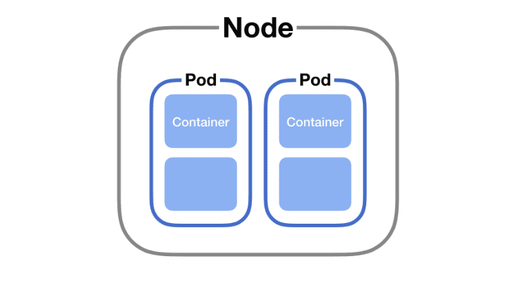
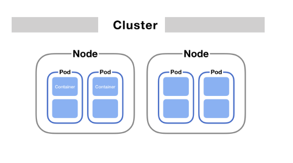

# Kubernetes

K8s(Kubernetes) is a container orchestration system. It is a system for managing containerized applications across multiple hosts. It provides basic mechanisms for deployment, maintenance, and scaling of applications.

## Table of Contents

- [Pod](#pod)
- [Additional Resources](#additional-resources)

## Pod

tl;dr: A pod is a environment for running containers, not a container itself.

Pod is the smallest deployable unit of computing that can be created and managed in Kubernetes.
A Pod is a group of one or more containers, with shared storage/network, and a specification for how to run the containers.
Therefore, a Pod is a Kubernetes abstraction that represents a group of one or more application containers (such as Docker or rkt), and some shared resources for those containers.

This means that a Pod is a logical collection of containers that are treated as a single entity for management purposes.
So, when we deploy containers with Kubernetes, we deploy them as Pods, where each Pod contains one or more containers.

Containers in a Pod share an IP address and port space, and can find each other via localhost.
So, when deploying multiple containers in a Pod, we should take care of the port confliction.

Also, containers in a Pod share the same storage volume, so we can share files between containers in a Pod.



We could deploy one or more Pods in a single Node. And the entire Kubernetes cluster is composed of multiple Nodes.



- [Execute pod](./pod-execution/)
- [Replica Set](./replicaset/)
- [Deployment](./deployment/)

### Pod Scaling

There are multiple ways for scaling Pods.

The most straightforward way is to manually scale the number of Pods by using `kubectl scale` command.

```bash
$ kubectl scale --replicas=3 deployment/myapp-deployment
```

Another way is to use `Horizontal Pod Autoscaler` (HPA) which automatically scales the number of Pods based on CPU utilization.

```bash
$ kubectl autoscale deployment/myapp-deployment --min=2 --max=5 --cpu-percent=80
```

### DaemonSet

A DaemonSet ensures that all (or some) Nodes run a copy of a Pod.
As nodes are added to the cluster, Pods are added to them.
As nodes are removed from the cluster, those Pods are garbage collected.
Deleting a DaemonSet will clean up the Pods it created.

Some typical uses of a DaemonSet are:

    * running a cluster storage daemon on every node
    * running a logs collection daemon on every node
    * running a node monitoring daemon on every node

In a simple case, one DaemonSet, covering all nodes, would be used for each type of daemon.
A more complex setup might use multiple DaemonSets for a single type of daemon, but with different flags and/or different memory and cpu requests for different hardware types.

### StatefulSet

StatefulSet is the workload API object used to manage stateful applications.

Manages the deployment and scaling of a set of Pods, and provides guarantees about the ordering and uniqueness of these Pods.

Like a Deployment, a StatefulSet manages Pods that are based on an identical container spec.
Unlike a Deployment, a StatefulSet maintains a sticky identity for each of its Pods.
These pods are created from the same spec, but are not interchangeable: each has a persistent identifier that it maintains across any rescheduling.

If you want to use storage volumes to provide persistence for your workload, you can use a StatefulSet as part of the solution.
Although individual Pods in a StatefulSet are susceptible to failure, the persistent Pod identifiers make it easier to match existing volumes to the new Pods that replace any that have failed.

StatefulSets are valuable for applications that require one or more of the following:

    * Stable, unique network identifiers.
    * Stable, persistent storage.
    * Ordered, graceful deployment and scaling.
    * Ordered, automated rolling updates.

- [Example StatefulSet for NGINX](./statefulset-nginx.yaml)

## Additional Resources

- [Kubernetes CronJob의 스케줄 변경 시 소급 적용된다?](https://blog.outsider.ne.kr/1662)

## References

- [K8S DaemonSet Official Doc](https://kubernetes.io/docs/concepts/workloads/controllers/daemonset/)
- [K8S StatefulSet Official Doc](https://kubernetes.io/docs/concepts/workloads/controllers/statefulset/)
